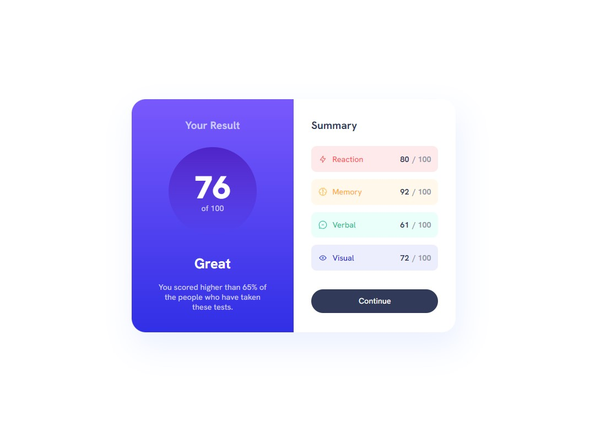

# Frontend Mentor - Results summary component solution

This is a solution to the [Results summary component challenge on Frontend Mentor](https://www.frontendmentor.io/challenges/results-summary-component-CE_K6s0maV). Frontend Mentor challenges help you improve your coding skills by building realistic projects.

## Table of contents

- [Overview](#overview)
  - [The challenge](#the-challenge)
  - [Screenshot](#screenshot)
  - [Links](#links)
- [My process](#my-process)
  - [Built with](#built-with)
- [Author](#author)

## Overview

### The challenge

Users should be able to:

- View the optimal layout for the interface depending on their device's screen size
- See hover and focus states for all interactive elements on the page

### Screenshot

### Links

- [Live Site URL](https://rodolfooliveiram.github.io/results-summary-component/)

## My process

My process to develop the solution for this challenge was first defining the HTML structure of the component and filling out the elements with static content.

Second I started to transform the style guide for the project into css styles.

Then considering that in a real project this component would be a parte of a more complete app with more other components that would be propably sharing common styles, I separated the css code in threes categories: utilities, for general css styles like fonts and colors that could be applied to all the app; global, basically for reseting default styles of HTML elements; and component, for specific styles to be applied to the component.

### Built with

- HTML
- CSS
- Flexbox
- CSS Grid

## Author

- Frontend Mentor - [@rodolfoalvesmdo](https://www.frontendmentor.io/profile/rodolfoalvesmdo)
